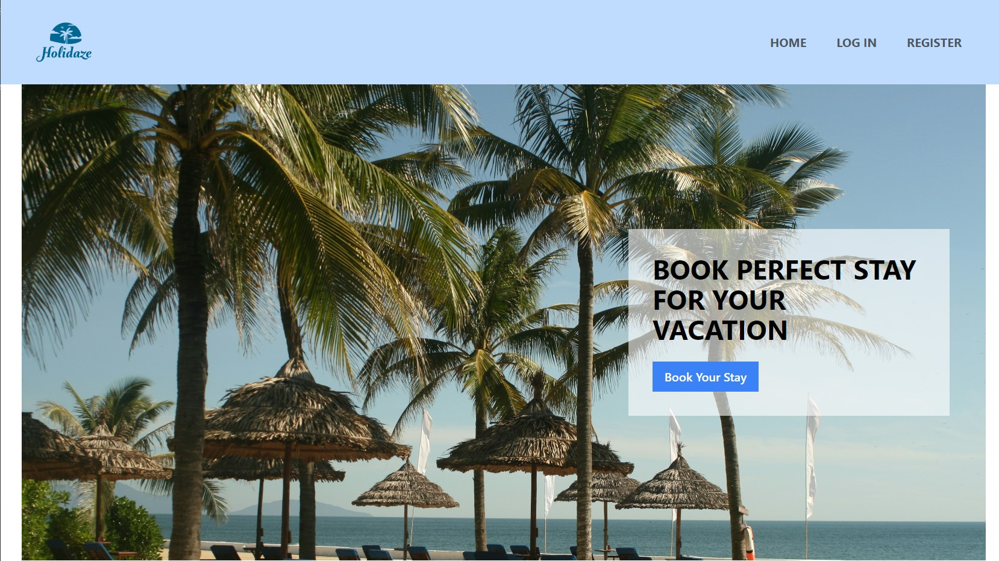

# **HOLIDAZE**

### Holidaze is a hotel booking system and a marketplace for business who want to lists their properties. Seemlessly connects travallers to find their memorable and incredble place to stay.

### Our project exam for semester two at NOROFF as Front-end DEveveloper.

## Holidaze on web



## Holidaze on mobile


## Task to Deliver

-   [x] <a href="https://www.notion.so/bddbabc198894d0ab56ac8df33ed4dc1?v=c97149a591814d62805eee525bc1dfd6&pvs=4"> Gant Chart </a>
-   [x] Design Prototype
-   [x] Stye Guide
-   [x] Kanban Board <https://trello.com/invite/b/hOqlxDHB/ATTI913b0598c0275bf7f0e42df88d4d28e41BA81414/final-exam-holidaze-kanban
-   [x] Repository
-   [x] Hosted Demo

## Built with

| Built      | Tools and Languages |
| ---------- | ------------------- |
| Plan       | Notion, Trello      |
| Design     | Figma               |
| Language   | HTML, JS            |
| Frameworks | Tailwind, React.Js  |
| Tools      | VS Code, Vite       |
| Host       | Netlify             |

## Getting Started

### Installation

1. Clone, Add and Push

```Shell
   git clone git@github.com:[GITHUB EXAM](https://github.com/Khintin/holidaze-finals)
```

2. Install dependencies

```shell
   npm install
```

3. To access local host and start the project

```shell
   npm run dev
```

# Contact

<div>
<a href="https://www.linkedin.com/in/cristina-s-635051115/">
  
 </a>
</div>
